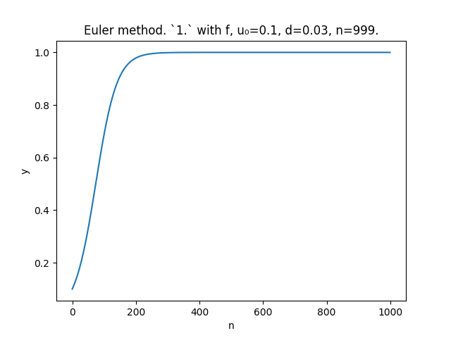
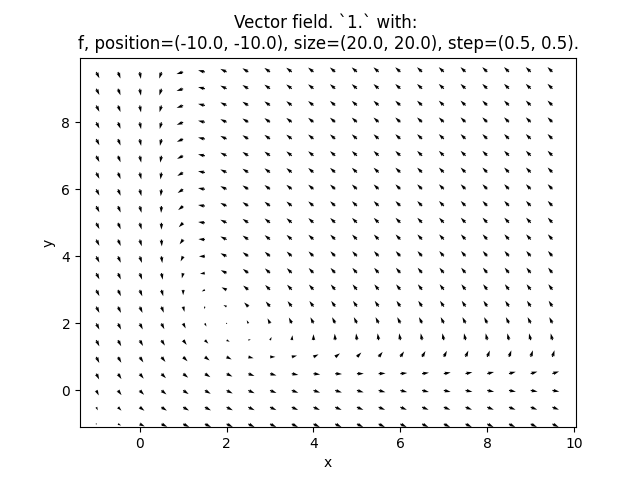

# Differentiation.
Approximate differential equations results by graphing:
- Euler's method;
- vector field.

Using `python`: `matplotlib` & `numpy`.

## Examples.
Euler's approximations:
- Logistic equation 
$$x' = x (1.0 - x)$$

Vector field:
- Prey-predator 
$$ 
x' = (1.0 - y) * x + 2.0 \newline
y' = y * (x - 1.0) - 2.0
$$

